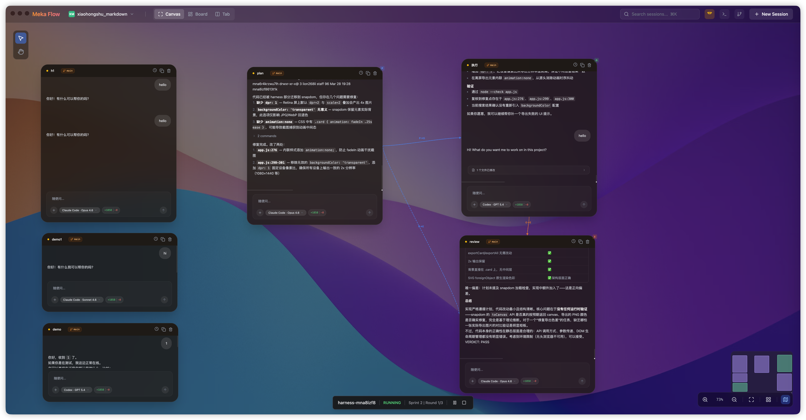
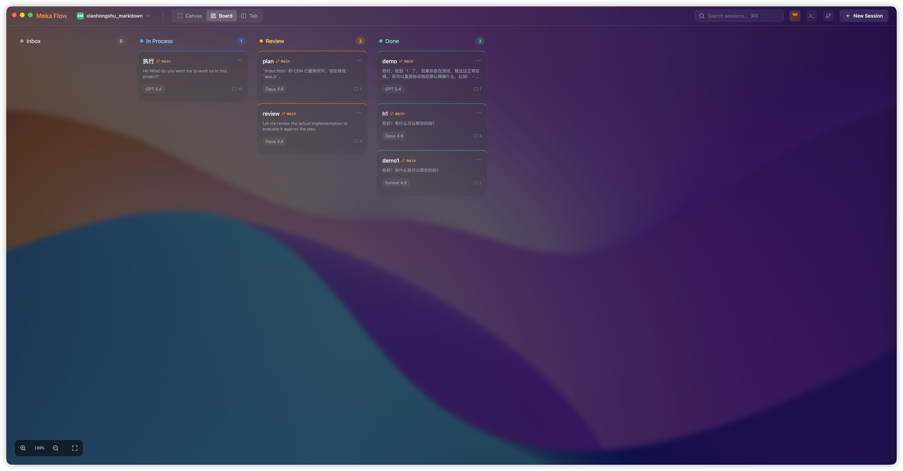
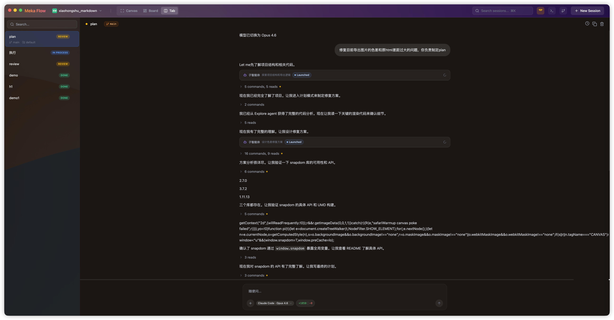

<p align="center">
  
</p>

<h1 align="center">Meka Flow</h1>

<p align="center">在无限画布上同时管理多个 AI 编程会话（Claude Code、Codex）的桌面应用。</p>

> 像管理便签一样管理你的 AI 会话 — 自由拖拽、分组广播、看板追踪，让多 Agent 协作变得直观。

## 功能亮点

**三种视图，灵活切换**

- **无限画布 (Canvas)** — 自由拖拽、缩放、多选会话，支持向选中会话批量广播消息



- **看板视图 (Board)** — 按状态列分组：inbox → in process → review → done，拖拽改变状态



- **标签页视图 (Tab)** — 传统标签页导航，内置搜索



**多 AI Agent 支持**

| Provider | 可选模型 |
|----------|---------|
| Claude Code | Sonnet 4.6 · Opus 4.6 |
| Codex | GPT 5.4 · GPT 5.4 Mini |


**富消息渲染**

- 流式响应、代码高亮（React Markdown + GFM）
- 工具调用可视化、子 Agent 状态追踪
- Todo 清单、交互式表单、文件变更摘要
- Skill 调用状态展示

**Git 集成**

- 实时 Git 文件变更监控（Rust 后端 + `notify` crate）
- 内置 Diff 查看器
- 每个会话可关联独立 Git 分支与 Worktree

**桌面体验 (Electron)**

- macOS 原生窗口风格（隐藏标题栏 + 交通灯按钮）
- 内置终端（xterm.js + node-pty）
- Rust sidecar 进程管理会话持久化（SQLite）
- Dynamic Island 浮窗交互

## 技术栈

| 层 | 技术 |
|----|------|
| 前端 | React 19 · TypeScript · Vite 6 · Tailwind CSS 4 |
| 桌面 | Electron · electron-vite · electron-builder |
| 后端 | Rust (Tokio) · SQLite (rusqlite) · JSON-RPC over stdio |
| 动画 | Motion (Framer Motion) |
| 图标 | Lucide React |
| 终端 | xterm.js · node-pty |

## 快速开始

### 环境要求

- **Node.js** ≥ 18
- **Rust** （仅 Electron 桌面模式需要）


### Electron 桌面模式

```bash
# 构建 Rust 后端 + 启动 Electron 开发模式
npm run dev:electron

# 打包 macOS DMG
npm run dist
```

## 可用脚本

| 命令 | 说明 |
|------|------|
| `npm run dev` | 启动 Web 开发服务器（Vite，端口 3000） |
| `npm run build` | 生产构建 |
| `npm run lint` | TypeScript 类型检查 |
| `npm run preview` | 预览生产构建 |
| `npm run clean` | 清除 dist/ |
| `npm run dev:electron` | 启动 Electron 开发模式（含 Rust 构建） |
| `npm run build:electron` | 构建 Electron + Rust（release） |
| `npm run dist` | 打包 macOS DMG |

## 项目结构

```
meka-flow/
├── src/                        # React 前端源码
│   ├── App.tsx                 # 应用入口，管理全局状态
│   ├── components/
│   │   ├── CanvasView.tsx      # 无限画布视图
│   │   ├── BoardView.tsx       # 看板视图
│   │   ├── TabView.tsx         # 标签页视图
│   │   ├── SessionWindow.tsx   # AI 会话窗口（核心组件）
│   │   ├── TopBar.tsx          # 顶部导航栏
│   │   ├── git/                # Git 面板相关组件
│   │   ├── message/            # 消息渲染组件
│   │   └── terminal/           # 终端面板组件
│   ├── contexts/               # React Context（Git 状态）
│   ├── services/               # 后端通信、Git 服务、Skill 扫描
│   ├── models.ts               # AI 模型定义与工具函数
│   ├── types.ts                # TypeScript 类型定义
│   └── constants.ts            # 布局常量
├── electron/                   # Electron 主进程
│   ├── main.ts                 # 窗口管理、IPC、PTY
│   ├── preload.ts              # 预加载脚本
│   ├── sidecar.ts              # Rust 后端进程管理
│   └── islandManager.ts        # Dynamic Island 管理
├── ai-backend/                 # Rust 后端（sidecar）
│   └── src/
│       ├── main.rs             # JSON-RPC stdio 服务
│       ├── db.rs               # SQLite 持久化
│       ├── session/            # 会话管理
│       ├── claude.rs           # Claude Code 集成
│       ├── codex.rs            # Codex 集成
│       ├── git/                # Git 操作与文件监控
│       └── normalizer.rs       # 响应格式标准化
├── dynamic-island/             # Dynamic Island 浮窗子应用
├── vite.config.ts              # Vite 配置
├── electron.vite.config.ts     # Electron Vite 配置
└── CLAUDE.md                   # AI 辅助开发指引
```

## 架构概览

```
┌─────────────────────────────────────────────┐
│                  Electron                    │
│  ┌────────────┐  ┌────────────────────────┐ │
│  │  Main      │  │  Renderer (Vite)       │ │
│  │  Process   │  │  ┌──────────────────┐  │ │
│  │            │◄─┤  │ App.tsx          │  │ │
│  │  - IPC     │  │  │  ├ CanvasView    │  │ │
│  │  - PTY     │  │  │  ├ BoardView     │  │ │
│  │  - Sidecar │  │  │  └ TabView       │  │ │
│  │            │  │  │    └ SessionWindow│  │ │
│  └─────┬──────┘  │  └──────────────────┘  │ │
│        │ stdio   └────────────────────────┘ │
│  ┌─────▼──────┐                             │
│  │ ai-backend │  Rust sidecar               │
│  │ - SQLite   │  - 会话持久化                │
│  │ - Claude   │  - AI Agent 集成             │
│  │ - Codex    │  - Git 文件监控              │
│  │ - Git watch│                              │
│  └────────────┘                             │
└─────────────────────────────────────────────┘
```


## 许可证

[MIT](LICENSE) — Copyright (c) 2026 osvald-go2
